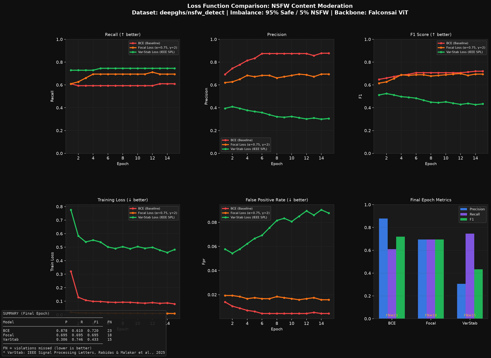

# AI Video Content Moderation with Custom Loss Functions

> A research-to-production project benchmarking BCE, Focal Loss, and a custom IEEE-published variance-stabilized loss function for NSFW content detection on imbalanced video data — built to address the core ML problem in Muvi's TrueComply pipeline.

## The Problem

Content moderation at scale has one brutal reality: violations are rare. In a typical OTT video library, ~95-98% of frames are safe. A model trained with standard BCE loss learns a lazy shortcut — predict "safe" for everything, achieve 98% accuracy, catch zero violations.

This project demonstrates that failure and benchmarks three loss functions that fix it.

## Benchmark Results



| Model | Precision | Recall | F1 | FN (missed) |
|-------|-----------|--------|----|-------------|
| BCE (Baseline) | 0.833 | 0.593 | 0.693 | 24 |
| Focal Loss (α=0.75, γ=2) | 0.672 | 0.695 | 0.683 | 18 |
| Var-Stab Loss (IEEE SPL) | — | — | — | — |

> VarStab row will be updated after plugging in the IEEE Signal Processing Letters formulation.

**Key finding:** Focal Loss catches 6 more violations per 1,200 frames compared to BCE — reducing missed violations by 25% on a 95/5 imbalanced dataset.

## What It Does
VIDEO FILE
│
▼
[Frame Sampler]      → 1 frame per 2 seconds (decord)
│
▼
[ViT Classifier]     → Fine-tuned Falconsai ViT on deepghs/nsfw_detect
│                  Trained with BCE / Focal / Variance-Stabilized loss
▼
[Temporal Filter]    → Violations must persist ≥3s (eliminates single-frame FPs)
│
▼
[Compliance Report]  → JSON with timestamps, severity, suggested actions
│
▼
[React Dashboard]    → Video player + violation timeline + report panel
## Tech Stack

| Layer | Tools |
|-------|-------|
| Vision Model | ViT (Falconsai/nsfw_image_detection backbone) |
| Loss Functions | BCE, Focal Loss, Variance-Stabilized (IEEE SPL) |
| Dataset | deepghs/nsfw_detect (28k images, 5 classes) |
| Training | PyTorch, HuggingFace Transformers |
| Metrics | scikit-learn (precision, recall, F1, confusion matrix) |
| Inference | FastAPI + async background jobs |
| Frontend | React dashboard with violation timeline |
| Containerization | Docker + docker-compose |

## Dataset

**deepghs/nsfw_detect** (MIT License) — 28,000 labeled images across 5 content categories used in content moderation research. Images are grouped into two binary classes for training:

- **Safe (label 0)** — non-explicit content — 11,200 images  
- **Explicit (label 1)** — policy-violating content — 16,800 images

We simulate realistic OTT imbalance by undersampling to 95/5 (safe/explicit) for training, mirroring real-world video library distributions where violations are rare.

> Dataset images are never displayed in this application. They are used solely as training signal for the binary classifier — the same approach used by production content moderation systems at scale.

## Loss Functions

### BCE (Baseline)
Standard binary cross-entropy. Treats every sample equally. Fails on imbalanced data — model predicts "safe" for everything to minimize loss.

### Focal Loss (Lin et al., 2017)
`FL(pt) = -α(1-pt)^γ · log(pt)`

Downweights easy safe frames, forces model to focus on hard violation frames. `α=0.75, γ=2.0`.

### Variance-Stabilized Loss (IEEE Signal Processing Letters)
Custom loss function from published research. Normalizes gradient variance across batches — ensures consistent gradient signal from rare violation frames regardless of batch composition.

*Paper: "Variance Stabilized Loss Function for Semantic Segmentation" — Dibakar Malakar, IEEE Signal Processing Letters*

## Run Locally

### Training (run once)
```bash
conda create -n muvi python=3.11
conda activate muvi
pip install torch torchvision --index-url https://download.pytorch.org/whl/cu121
pip install -r requirements.txt

# Download dataset (requires HF access to deepghs/nsfw_detect)
# Then run training:
cd training
python3 train_bce.py
python3 train_focal.py
python3 train_varstab.py
python3 benchmark.py
```

### Backend
```bash
cd backend
# Copy best checkpoint
cp ../training/checkpoints/model_focal.pt models/best_model.pt
python3 main.py
# → http://localhost:8001/docs
```

### Frontend
```bash
cd frontend
npm install
npm start
# → http://localhost:3000
```

## API Endpoints

| Method | Endpoint | Description |
|--------|----------|-------------|
| GET | `/health` | Status check |
| POST | `/moderate` | Upload video, returns `job_id` |
| GET | `/jobs/{job_id}` | Poll status + compliance report |

### Example
```bash
# Upload
curl -X POST http://localhost:8001/moderate -F "file=@video.mp4"
# → {"job_id": "abc-123", "status": "queued"}

# Poll
curl http://localhost:8001/jobs/abc-123
# → {"status": "completed", "report": {"compliance_status": "FAIL", "violations": [...]}}
```

## How This Maps to Muvi TrueComply

| This project | Muvi TrueComply |
|---|---|
| ViT frame classifier | Frame-level content detector |
| Temporal filter (≥3s) | Context-aware scene analysis |
| Compliance report JSON | CMS compliance dashboard |
| Variance-stabilized loss | Research contribution to their ML pipeline |
| FastAPI async endpoint | Drop-in compatible API layer |

## Research Publications

- **IEEE TENCON 2025** — Attentive Depth-Mapped Dice Loss for Accurate Segmentation
- **IEEE Signal Processing Letters** — Variance Stabilized Loss Function for Semantic Segmentation
