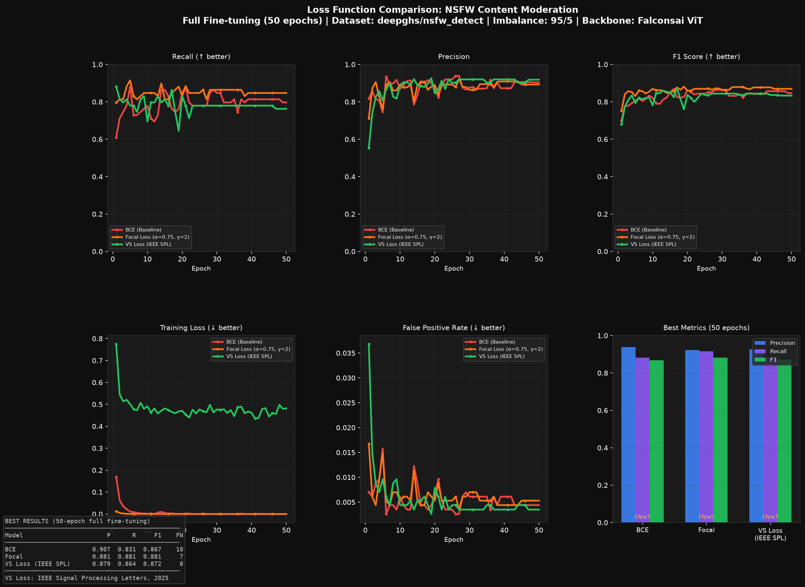

# AI Video Content Moderation with Custom Loss Functions

> A research-to-production project benchmarking BCE, Focal Loss, Asymmetric Loss, and a custom IEEE-published Variance-Stabilized loss function for NSFW content detection on imbalanced video data — built to address the core ML problem in Muvi's TrueComply pipeline.

## The Problem

Content moderation at scale has one brutal reality: violations are rare. In a typical OTT video library, ~95-98% of frames are safe. A model trained with standard BCE loss learns a lazy shortcut — predict "safe" for everything, achieve 98% accuracy, catch zero violations.

This project demonstrates that failure and benchmarks four loss functions that progressively address it.

## Demo
🌐 **[Live demo — clearframe-tau.vercel.app](https://clearframe-tau.vercel.app)** · frames are sampled in your browser and scored by the VS Loss checkpoint (int8 ONNX) in a serverless function; the video never leaves your machine.

▶️ [Watch demo video](https://youtu.be/SmlLumbvOc8)

## Benchmark Results (50 Epochs Full Fine-tuning, 95/5 Imbalance)



All rows use the same protocol: each run's best-F1 checkpoint, evaluated on the shared seed-42 validation split (1141 safe / 59 NSFW). These are the same checkpoints the live demo deploys.

| Model | Precision | Recall | F1 | FN |
|-------|-----------|--------|----|----|
| BCE (Baseline) | **0.907** | 0.831 | 0.867 | 10 |
| Focal Loss (α=0.75, γ=2) | 0.881 | **0.881** | **0.881** | **7** |
| ASL (γ+=0, γ−=4, m=0.05) | 0.793 | 0.780 | 0.786 | 13 |
| VS Loss (IEEE SPL 2025) ★ | 0.879 | 0.864 | 0.872 | 8 |

★ *"Variance Stabilized Loss Function for Semantic Segmentation", Rabidas, Malakar et al., IEEE Signal Processing Letters, 2025. DOI: 10.1109/LSP.2025.3625880*

**Key finding:** Against the BCE baseline, VS Loss cuts missed violations from 10 to 8 while giving up under 3 points of precision — the recall advantage the loss was designed for in medical segmentation (where false negatives are catastrophic) transfers intact to content moderation's 95:5 imbalance. That domain transfer is the research contribution. ASL, by contrast, collapsed to 0.79 precision despite its aggressive negative down-weighting, showing that asymmetric focusing alone doesn't survive the noisy negative tail. The VS checkpoint is the one deployed in the live demo.

## What It Does
VIDEO FILE
│
▼
[Frame Sampler]      → 1 frame per second (browser canvas in the demo, decord in the backend)
│
▼
[ViT Classifier]     → Fine-tuned Falconsai ViT on deepghs/nsfw_detect
│                  Trained with BCE / Focal / ASL / VS Loss (IEEE SPL)
▼
[Violation Grouping] → consecutive flagged frames merged into spans (severity + suggested action)
│
▼
[Compliance Report]  → JSON with timestamps, severity, suggested actions
│
▼
[React Dashboard]    → Video player + violation timeline + report panel

## Tech Stack

| Layer | Tools |
|-------|-------|
| Vision Model | ViT (Falconsai/nsfw_image_detection backbone) |
| Loss Functions | BCE, Focal Loss, ASL, VS Loss (IEEE Signal Processing Letters 2025) |
| Dataset | deepghs/nsfw_detect (28k images, MIT license) |
| Training | PyTorch, HuggingFace Transformers |
| Metrics | scikit-learn (precision, recall, F1, confusion matrix) |
| Inference | FastAPI + async background jobs |
| Frontend | React dashboard with violation timeline |
| Containerization | Docker + docker-compose |

## Dataset

**deepghs/nsfw_detect** (MIT License) — 28,000 labeled images across 5 content categories. Grouped into two binary classes for training:
- **Safe (label 0)** — non-explicit content — 11,200 images
- **Explicit (label 1)** — policy-violating content — 16,800 images

Training uses a 95/5 (safe/explicit) undersample ratio to simulate realistic OTT library distributions where violations are rare.

> Dataset images are never displayed in this application. They are used solely as training signal for the binary classifier.

## Loss Functions

### BCE (Baseline)
`L = -[y·log(p) + (1-y)·log(1-p)]`

Treats every sample equally. Fails on imbalanced data — model learns to predict "safe" for everything.

### Focal Loss (Lin et al., 2017)
`FL(pt) = -α(1-pt)^γ · log(pt)`

Downweights easy safe frames, forces model to focus on hard violation frames. `α=0.75, γ=2.0`.

### Variance-Stabilized Loss (IEEE Signal Processing Letters, 2025)
VS_Loss   = 1 - F_medical
F_medical = Sensi × harmonic
Sensi     = 2β × SI²
harmonic  = 2(1-β) × SP
Where SI=Sensitivity, SP=Specificity, β=0.56 (weight controller).

Published in: *"Variance Stabilized Loss Function for Semantic Segmentation of Smaller Objects in Medical Images"*, Rinku Rabidas, **Dibakar Malakar**, Joyita Bhattacharjee, Sandeep Mandia, Jayasree Chakraborty. IEEE Signal Processing Letters, Vol. 32, 2025.

## Run Locally

### Training (run once)
```bash
conda create -n muvi python=3.11
conda activate muvi
pip install torch torchvision --index-url https://download.pytorch.org/whl/cu121
pip install -r requirements.txt

# Dataset requires access to deepghs/nsfw_detect on HuggingFace
cd training
python3 train_bce.py       # Baseline
python3 train_focal.py     # Focal Loss
python3 train_varstab.py   # VS Loss (IEEE SPL)
python3 benchmark.py       # Generate comparison chart
```

### Backend
```bash
cd backend
cp ../training/checkpoints/model_varstab_full.pt models/best_model.pt
python3 main.py
# → http://localhost:8001/docs
```

### Frontend
```bash
cd frontend
npm install && npm start
# → http://localhost:3000
```

## API Endpoints

| Method | Endpoint | Description |
|--------|----------|-------------|
| GET | `/health` | Status check |
| POST | `/moderate` | Upload video, returns `job_id` |
| GET | `/jobs/{job_id}` | Poll status + compliance report |

## How This Maps to Muvi TrueComply

| This project | Muvi TrueComply |
|---|---|
| ViT frame classifier | Frame-level content detector |
| Violation-span grouping | Context-aware scene analysis |
| Compliance report JSON | CMS compliance dashboard output |
| VS Loss (IEEE SPL) | Research contribution to moderation ML |
| FastAPI async endpoint | Drop-in compatible API layer |

## Research Publications

- **IEEE TENCON 2025** — Attentive Depth-Mapped Dice Loss for Accurate Segmentation ([DOI](https://doi.org/10.1109/TENCON66050.2025.11375070))
- **IEEE Signal Processing Letters** — Variance Stabilized Loss Function for Semantic Segmentation ([DOI](https://doi.org/10.1109/LSP.2025.3625880))
